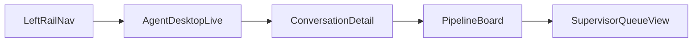

# Voice CRM Low-Fidelity Wireframes

Date: 2026-04-30  
Scope: Low-fi structure for Agent Desktop, Pipeline Board, Conversation Detail, and Supervisor Queue  
Research Phase: Bidirectional (task flow to screen structure)

## Wireframe 1: Agent Desktop (Live Call)
```text
+--------------------------------------------------------------------------------------+
| LeftRail             | CenterStream                          | RightContext         |
|---------------------|----------------------------------------|----------------------|
| Home                | Header: OperatorCockpit + KPIcards     | SelectedInteraction  |
| Live (active)       |----------------------------------------| CallControls         |
| Pipeline            | InteractionList                        | (Accept/Hold/...)    |
| Contacts            | - Caller, Queue, Timer, Priority,Stage |----------------------|
| Automations         | - Sort: NeedsAttention first           | LiveTranscript       |
| Analytics           | - Quick filter: Emergency / Callbacks  | SpeakerBadges        |
|                     |----------------------------------------| AutoScrollToggle     |
| DensityToggle       | Focus row -> highlighted               |----------------------|
| Comfortable/Compact |                                        | Extraction +         |
|                     |                                        | Disposition cards    |
+--------------------------------------------------------------------------------------+
```

## Wireframe 2: Pipeline Board
```text
+--------------------------------------------------------------------------------------+
| PipelineHeader: StageFilter | OwnerFilter | TimeRange | Board/List toggle            |
|--------------------------------------------------------------------------------------|
| New               | Connected         | Qualified         | Booked                      |
|------------------|-------------------|-------------------|-----------------------------|
| Card VC-301      | Card VC-303       | Card VC-305       | Card VC-306                |
| Card VC-302      | Card VC-304       |                   |                            |
|                  |                   |                   |                            |
| DropValidation: Show required fields when stage changes                             |
+--------------------------------------------------------------------------------------+
```

## Wireframe 3: Conversation Detail
```text
+--------------------------------------------------------------------------------------+
| ConversationHeader: CallerName | Status | Queue | RecordingBadge                     |
|--------------------------------------------------------------------------------------|
| TranscriptPane (70%)                               | Contact360 (30%)                 |
| - Live lines                                       | - Profile basics                 |
| - Freeze/Resume scroll                             | - Previous calls                 |
| - Confidence highlights                            | - Notes/tasks                    |
|--------------------------------------------------------------------------------------|
| BottomActionBar: Summarize | Escalate | AssignOwner | SubmitDisposition               |
+--------------------------------------------------------------------------------------+
```

## Wireframe 4: Supervisor Queue View
```text
+--------------------------------------------------------------------------------------+
| QueueHealthCards: QueueLoad | AtRiskSLA | CoachableMoments | CallbackBacklog             |
|--------------------------------------------------------------------------------------|
| TeamTable: Agent | ActiveCalls | AvgHandleTime | TransferRate | State                      |
|--------------------------------------------------------------------------------------|
| AlertFeed:                                                                      [..] |
| - P1 waiting over threshold                                                         |
| - Repeated barge-in sessions                                                        |
| - Stale wrap-up tasks                                                               |
+--------------------------------------------------------------------------------------+
```

## View Relationship


## References
[^1]: Nielsen Norman Group. (2009). Progressive Disclosure. https://www.nngroup.com/articles/progressive-disclosure
[^2]: Nielsen Norman Group. (2025). Dashboards: Making Charts and Graphs Easier to Understand. https://www.nngroup.com/articles/dashboards-preattentive/
[^3]: Internal Deployment Doc. (2026). Construction Receptionist. `docs/deployment/construction-receptionist.md`.
